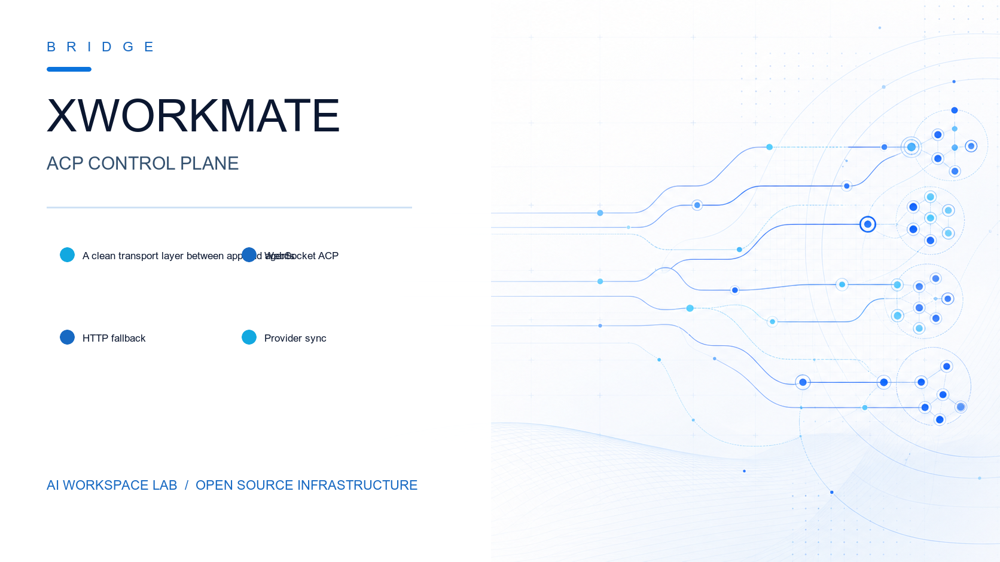

[](https://github.com/ai-workspace-lab/xworkmate-bridge) [](https://go.dev/) [](./docs/api-reference.md) [](./docs/architecture/adr-unified-bridge-entrypoints.md)

# XWorkmate Bridge

`xworkmate-bridge` is the standalone repository for the XWorkmate ACP Bridge Server and the embedded Go helper previously stored under `xworkmate-app/go/go_core`.

## What lives here

- ACP Bridge HTTP/WebSocket server
- ACP stdio bridge entrypoint
- Go helper runtime packages used by the ACP bridge
- Unit tests for bridge routing, RPC contracts, mounts, runtime dispatch, and provider sync

## ACP Forwarding Topology

This repository exposes one APP-facing bridge entrypoint and proxies traffic
to four independent upstream production services. The APP-facing canonical ACP
path is WebSocket `/acp`; HTTP `/acp/rpc` remains available for CI, scripts,
debugging, and compatibility fallback under
`https://xworkmate-bridge.svc.plus`.
OpenClaw task submission is the only dedicated HTTP task route:
`POST /gateway/openclaw` for `session.start` and follow-up `session.message`.
It is not a global ACP base endpoint.

## Shared task sessions

Accounts owns durable cross-terminal task/session state. Bridge keeps the
client-compatible `/api/v1` surface as a stateless, bounded streaming proxy.
Set `BRIDGE_ACCOUNTS_SESSION_API_URL` to the Accounts origin (and optional base
path), for example `https://accounts.svc.plus`. Bridge appends the incoming
`/api/v1/...` path and query verbatim. If the variable is absent or invalid,
ACP forwarding remains available and task-session routes return `503`.

The session API exposes namespace listing, session create/list/snapshot,
ordered event replay, and idempotent message append under `/api/v1`. Every
route requires the existing Bearer credential. Bridge preserves its current
public authentication check, forwards `Authorization` to Accounts, and never
derives or accepts account identity from request data.

Bridge does not store, cache, migrate, or persist session data or artifacts.
Accounts owns snapshots, ordered events, message idempotency, and task-run
state. Scheduler/Accounts callbacks persist ACP execution results; Bridge does
not write execution state locally.

Architecture topology: [docs/architecture/acp-forwarding-topology.md](/Users/shenlan/workspaces/cloud-neutral-toolkit/xworkmate-bridge/docs/architecture/acp-forwarding-topology.md)

ADR for the unified APP-facing bridge contract: [docs/architecture/adr-unified-bridge-entrypoints.md](/Users/shenlan/workspaces/cloud-neutral-toolkit/xworkmate-bridge/docs/architecture/adr-unified-bridge-entrypoints.md)

Example provider sync config: [example/config.yaml](/Users/shenlan/workspaces/cloud-neutral-toolkit/xworkmate-bridge/example/config.yaml)

API reference: [docs/api-reference.md](/Users/shenlan/workspaces/cloud-neutral-toolkit/xworkmate-bridge/docs/api-reference.md)

Backend API design: [docs/backend-api-design.md](/Users/shenlan/workspaces/cloud-neutral-toolkit/xworkmate-bridge/docs/backend-api-design.md)

## Compatibility

For compatibility with `xworkmate-app`, the built helper binary name remains `xworkmate-go-core`.

## Commands

```bash
make test
make build
./build/bin/xworkmate-go-core serve --listen 127.0.0.1:8787
```

## GitHub Actions

This repository includes one GitHub Actions pipeline with four stages:

- `prep`: Go static checks
- `build`: build the `linux/amd64` artifact for the x86 target host and upload it
- `deploy`: run Ansible CD with `x-evor/playbooks`
- `validate`: verify the public endpoints after deployment

GitHub Releases are published only after `deploy` and `validate` both succeed.
In this repository, a published Release means the built image has been deployed
to `xworkmate-bridge.svc.plus` and passed post-deploy validation there.

### Deploy stage

The deploy stage checks out:

- this service repository into `xworkmate-bridge/`
- the `x-evor/playbooks` repository into `playbooks/`

Then it installs the native `linux/amd64` bridge binary with
`scripts/github-actions/deploy-native-binary.sh`. The native bridge runs as the
`ubuntu` user's systemd user service:

- binary: `/home/ubuntu/.local/bin/xworkmate-go-core`
- unit: `/home/ubuntu/.config/systemd/user/xworkmate-bridge.service`
- restart: `systemctl --user restart xworkmate-bridge.service`

During migration the script performs a one-time stop/disable of the old system
unit, then deploys and restarts through `ubuntu@<target>`.

### Validate stage

The validate stage proves production alignment against the bridge public
contract:

- bridge root and `/api/ping`
- strict image / tag / commit / version match against the built image ref
- upstream ACP capability probes for `codex`, `opencode`, and `gemini`
- minimal `session.start` smoke tests through the bridge JSON-RPC contract

Required GitHub secrets:

- `SINGLE_NODE_VPS_SSH_PRIVATE_KEY`: private key used by the Actions runner to SSH into the target host
- `WORKSPACE_REPO_TOKEN`: token with access to checkout `x-evor/playbooks`

Optional GitHub secrets:

- `SSH_KNOWN_HOSTS`: pre-seeded known_hosts content for stricter host verification

Optional workflow input:

- `ai_workspace_auth_token`: manual dispatch input that is forwarded as `AI_WORKSPACE_AUTH_TOKEN`

## Environment

- `ACP_LISTEN_ADDR`: listen address for `serve` mode, default `127.0.0.1:8787`
- `OUTPUT_DIR`: optional output directory for `make build`
- `OUTPUT_PATH`: optional explicit build path for `make build`
