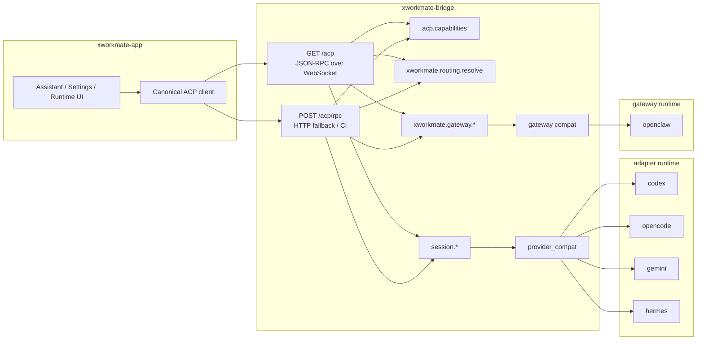
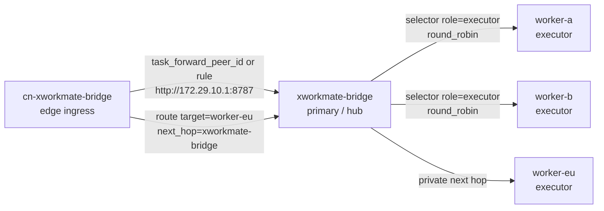

# ACP Forwarding Topology

Last Updated: 2026-06-02

本文档只描述当前保留的 canonical topology。

## App-Facing Mainline

对 `xworkmate-app` 来说，bridge 只有一个 canonical surface：

- `GET /acp` WebSocket，默认主链
- `POST /acp/rpc`，CI、脚本、调试、兼容 fallback 和 OpenClaw gateway task submit

app 只感知 method family：

- `acp.capabilities`
- `xworkmate.routing.resolve`
- `session.*`
- `xworkmate.gateway.*`

## Canonical Topology

## Invariants

- app 不直接访问 provider-specific public URL
- app 的 OpenClaw `session.start` / follow-up `session.message` 也使用 `/acp/rpc`
- app 不保存或解析 provider/gateway 专用 URL
- provider catalog 与 gatewayProviders 由 bridge 独占生成
- bridge 只暴露 canonical ACP contract
- provider / gateway 实际地址属于 bridge internal truth
- bridge-to-bridge task forward 只使用 WireGuard over VLESS 私网 endpoint，公网域名只作为 ingress

## Distributed Task Router

分布式转发是 bridge 内部能力，不改变 app-facing canonical surface。每个 bridge 从静态 peer catalog、forwarding rules 和 routes 得出下一跳：

Router contract:

- `nodes` 保存节点身份、角色、能力、zone 和私网 `bridge_endpoint`
- `forwarding.rules` 选择最终 target node
- `forwarding.routes` 选择 next-hop，用于星状或显式 mesh
- `session.start` 选中 target 后，`session.message` 使用本机 session route store 粘到同一个 target
- `X-XWorkmate-Forward-Hop` 受 `forwarding.hop_limit` 限制，避免循环
- `https://*.svc.plus` 这类公网域名不能作为 bridge-to-bridge endpoint

## Non-Contract Facts

下列事实可能存在于部署层，但不是 app contract：

- `127.0.0.1:*` 端口
- systemd unit 名
- adapter runtime 监听地址
- stdio / process lifecycle
