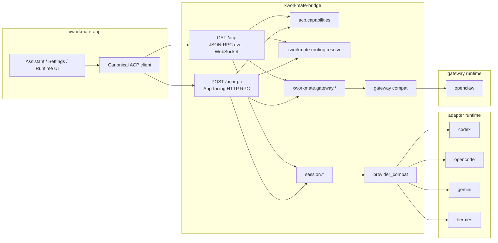

# ACP Forwarding Topology

Last Updated: 2026-04-23

本文档只描述当前保留的 canonical topology。

## App-Facing Mainline

对 `xworkmate-app` 来说，bridge 只有一个 canonical surface：

- `GET /acp` WebSocket
- `POST /acp/rpc`

app 只感知 method family：

- `acp.capabilities`
- `xworkmate.routing.resolve`
- `session.*`
- `xworkmate.gateway.*`

## Canonical Topology

## Invariants

- app 不直接访问 provider-specific public URL
- app 不直接访问 openclaw public URL
- provider catalog 与 gatewayProviders 由 bridge 独占生成
- bridge 只暴露 canonical ACP contract
- provider / gateway 实际地址属于 bridge internal truth

## Non-Contract Facts

下列事实可能存在于部署层，但不是 app contract：

- `127.0.0.1:*` 端口
- systemd unit 名
- adapter runtime 监听地址
- stdio / process lifecycle
