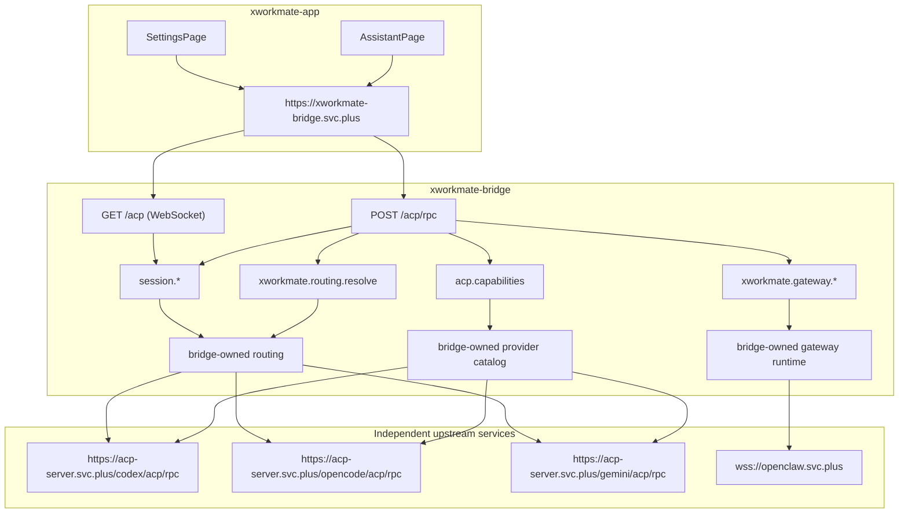
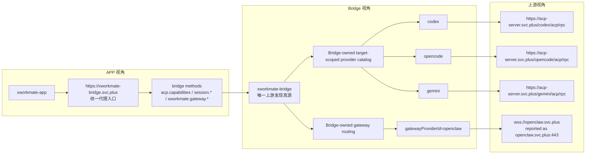

# ACP Forwarding Topology

Last Updated: 2026-04-13

本文件描述当前 `xworkmate-app <-> xworkmate-bridge` 主链下的 bridge-only forwarding topology。

See also:

- [XWorkmate Core Module Inventory](/Users/shenlan/workspaces/cloud-neutral-toolkit/xworkmate-app/docs/architecture/xworkmate-core-module-inventory-2026-04-13.md)
- [ADR: Unified Bridge Entry Points](/Users/shenlan/workspaces/cloud-neutral-toolkit/xworkmate-bridge/docs/architecture/adr-unified-bridge-entrypoints.md)

## App-Facing Mainline

对 app 来说，当前主链只有两类面向 bridge 的交互：

- `assistant` surface 进入 ACP control-plane：`acp.capabilities`、`xworkmate.routing.resolve`、`session.*`
- `settings` surface 进入 gateway runtime / connection flow：`acp.capabilities`、`xworkmate.gateway.*`

不管 bridge 内部还保留哪些 provider / gateway mode / capability flag，app-facing 公共入口都只有 bridge origin。

## Topology

## Three-Layer View

This view separates what the app sees, what the bridge owns, and what the
real upstream production targets are. The upstream ACP and gateway services
exist independently, but for the app they are all accessed through the single
public bridge origin: `https://xworkmate-bridge.svc.plus`.

Important distinction:

- the upstream services are independent production services, not embedded
  inside the bridge
- for the app, ACP discovery, session execution, and gateway runtime traffic
  are all proxied through `https://xworkmate-bridge.svc.plus`
- upstream authentication is unified through
  `Authorization: Bearer $INTERNAL_SERVICE_TOKEN`
- `acp.capabilities` is the single APP-facing source for task dialog modes and
  target-scoped provider catalogs
- `providerCatalog` currently advertises the ACP single-agent providers:
  `codex`, `opencode`, and `gemini`
- `gatewayProviders` currently advertises the gateway-scoped providers, such as
  `openclaw`
- `availableExecutionTargets` tells the app which first-level task dialog modes
  are currently available
- for `gatewayProviderId=openclaw`, the bridge rewrites the upstream target to
  `wss://openclaw.svc.plus`
## Production Truth

当前 production forwarding 事实：

- canonical app-facing origin: `https://xworkmate-bridge.svc.plus`
- canonical app-facing ACP paths:
  - `POST /acp/rpc`
  - `GET /acp`
- current built-in single-agent provider catalog:
  - `codex`
  - `opencode`
  - `gemini`
- current production gateway forwarding target:
  - `openclaw -> wss://openclaw.svc.plus`

对 app 而言：

- provider catalog、routing、gateway runtime 都是 bridge-owned metadata / behavior
- upstream URL 存在，但不是 app 的直接合同
- gateway backend、provider IDs、可选 capability flag 也都不是 app shell 模块分类

## Invariants

- app traffic reaches upstream ACP and gateway services only through the bridge
- app does not call `acp-server.svc.plus/*` or `openclaw.svc.plus` directly
- upstream auth stays bridge-internal:
  - `Authorization: Bearer $INTERNAL_SERVICE_TOKEN`
- `acp.capabilities` is the provider / capability discovery source
- `xworkmate.routing.resolve` is the routing resolution source
- `xworkmate.gateway.*` is the gateway runtime method family
- bridge may expose additional routing metadata, but that metadata must not be interpreted as extra app surfaces or legacy module shells
